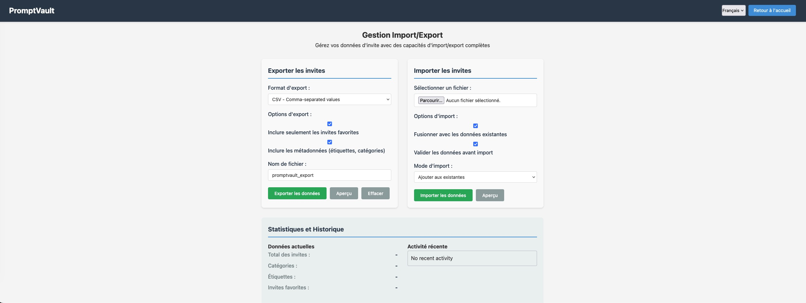

<h1 align="center">
  <a href="https://codeberg.org/medenor/promptvault">
    
  </a>
</h1>

<div align="center">
  PromptVault
  <br />
  <a href="#about"><strong>Explore the screenshots »</strong></a>
  <br />
  <br />
  <a href="https://codeberg.org/medenor/promptvault/issues/new?assignees=&labels=bug&template=01_BUG_REPORT.md&title=bug%3A+">Report a Bug</a>
  ·
  <a href="https://codeberg.org/medenor/promptvault/issues/new?assignees=&labels=enhancement&template=02_FEATURE_REQUEST.md&title=feat%3A+">Request a Feature</a>
  ·
  <a href="https://codeberg.org/medenor/promptvault/issues/new?assignees=&labels=question&template=04_SUPPORT_QUESTION.md&title=support%3A+">Ask a Question</a>
</div>

<div align="center">
<br />

[](https://www.gnu.org/licenses/agpl-3.0)
[](https://codeberg.org/medenor/promptvault/issues)
[](https://codeberg.org/medenor)
[](https://codeberg.org/medenor/promptvault/)
[](https://code.visualstudio.com)
</div>

<details open="open">
<summary>Table of Contents</summary>

- [About](#about)
  - [Built With](#built-with)
  - [Version Control](#version-control)
- [Getting Started](#getting-started)
  - [Prerequisites](#prerequisites)
  - [Installation](#installation)
- [Usage](#usage)
- [Roadmap](#roadmap)
- [Support](#support)
- [Project assistance](#project-assistance)
- [Contributing](#contributing)
- [Authors & contributors](#authors--contributors)
- [Security](#security)
- [License](#license)
- [Acknowledgements](#acknowledgements)

</details>

---

## About

PromptVault is a modern web-based prompt management application designed to help users easily organize, store, and retrieve their prompts for various AI applications, software development, content marketing, and much more. Whether you are a developer, writer, marketer, or simply a user of AI-based tools, PromptVault allows you to centralize your prompts and improve your productivity through a responsive web interface accessible from any browser.

### Built With

- [Python](https://www.python.org/)
- [FastAPI](https://fastapi.tiangolo.com/) - Modern web framework
- [Uvicorn](https://www.uvicorn.org/) - High-performance ASGI server
- [Jinja2](https://jinja.palletsprojects.com/) - Template engine
- [Docker](https://www.docker.com/) - Containerization platform

### Version Control ✅

PromptVault includes a robust, Git-like version control system for all prompts, ensuring full traceability and a clear history of changes. This feature is **fully implemented and production-ready**. Key features include:

- **Automatic Versioning**: Every update to a prompt automatically creates a new version with complete metadata
- **Unique Version Identifiers**: Each prompt version is assigned a UUID for reliable tracking
- **Detailed Metadata**: Every version tracks essential metadata including timestamp, author, and commit message
- **Version History View**: A dedicated modal dialog allows users to browse a prompt's complete version history with all commits and details
- **Diff Visualization**: Easily compare any two versions to see precise changes in prompt content, title, category, and tags with color-coded highlighting
- **Revert Functionality**: Users can safely revert a prompt to any previous version, which creates a new commit reflecting the reverted state (history is never lost)
- **Keyboard Shortcuts**: Quick access with Cmd+H (Mac) or Ctrl+H (Windows/Linux) to open version history
- **Multi-language Support**: Version control UI available in English, French, Spanish, and German

For detailed usage instructions, see [Version Control Documentation](docs/VERSION_CONTROL.md).

### Architecture

PromptVault follows a modular architecture with dedicated service classes for different functionalities:

- **PromptDataService**: Handles all data-related operations including loading, saving, and migration of prompt data
- **PromptFilterService**: Manages filtering and searching logic for prompts
- **PromptVersioningService**: Handles version control operations for prompts
- **PromptImportExportService**: Manages import and export operations in various formats (CSV, Markdown)
- **BackupService**: Provides comprehensive data backup and restoration capabilities with automatic pre-operation backups

This modular design improves code maintainability, testability, and extensibility.

### Data Backup System (WIP since migration to WebApp)

PromptVault includes a robust backup system to prevent data loss and enable easy recovery:

- **Automatic Backups**: Pre-operation backups are created automatically before risky operations (import, bulk delete, bulk update)
- **Manual Backups**: Users can create manual backups at any time through the File menu
- **Backup Management**: Full-featured backup dialog for viewing, restoring, and managing all backups
- **Smart Retention**: Configurable cleanup policies to remove old backups and save disk space
- **Compression**: Automatic compression of older backups to optimize storage usage
- **Safety Features**: Pre-restore backups ensure no data loss during restoration operations
- **Complete Metadata**: Every backup includes comprehensive metadata (timestamp, size, prompt count, author)

<details>
<summary>Screenshots</summary>
<br>

<div align="center">

### Main Interface


### Import/Export Management


### Prompt Editor


</div>
</details>

## Getting Started

### Prerequisites

- Python 3.8+
- Docker (recommended for production deployment)

### Quick Start with Docker

The fastest way to get started is using Docker:

```bash
git clone https://codeberg.org/medenor/promptvault.git
cd PromptVault
docker-compose up --build
```

Then open your browser to `http://localhost:8001`

### Manual Installation

1. **Clone the repository**:

    ```bash
    git clone https://codeberg.org/medenor/promptvault.git
    cd PromptVault
    ```

2. **Create a virtual environment** (recommended):

    ```bash
    python -m venv venv
    source venv/bin/activate  # On Windows, use `venv\Scripts\activate`
    ```

3. **Install PromptVault and its dependencies**:

    ```bash
    pip install .
    ```

    For development work you can install in editable mode:

    ```bash
    pip install -e .
    ```

## Usage

### Web Application (Recommended)

PromptVault is primarily a web-based application that runs in your browser and can be deployed as a Docker container.

#### Running with Docker (Production)

```bash
docker-compose up --build
```

Open your browser and go to `http://localhost:8001`

#### Running Locally (Development)

1. Install dependencies:

```bash
pip install -e .
```

2. Run the web application:

```bash
python run_web.py
```

3. Open your browser and go to `http://localhost:8000`

**Note:** PromptVault is now a web-only application. The desktop version has been deprecated and removed.

### Features

- **Prompt Management**: Create, edit, delete, and organize prompts through an intuitive web interface
- **Version Control**: Git-like versioning system with full history tracking, diff visualization, and safe revert functionality
- **Categories & Tags**: Organize prompts with categories and tags for easy discovery
- **Search & Filter (WIP since migration to WebApp)**: Find prompts quickly with advanced filtering and search capabilities
- **Import/Export**: Support for CSV, Markdown, and JSON formats with preview functionality
- **Backup System (WIP since migration to WebApp)**: Comprehensive data backup and restoration with automatic and manual options
- **Responsive Design**: Modern, mobile-friendly interface that works on all devices
- **Multi-language Support**: Internationalization with English, French, Spanish, and German

### Internationalization

PromptVault supports multiple languages (English, French, Spanish, German). The application will automatically detect your system language, but you can also change languages from the language selector in the header.

**Translation Files:**

- Web interface uses JSON translation files in `src/web/static/locales/`
- Translations are loaded dynamically using i18next

### Project Structure

The project follows a clean, modular web-first architecture:

- `src/`: Main source code directory
  - `src/web/`:
    - `src/web/app.py`: FastAPI application and REST API routes
    - `src/web/templates/`: Jinja2 HTML templates
    - `src/web/static/`: CSS stylesheets, JavaScript files, and locales
  - `src/services/`: Business logic and data services
    - `src/services/backup_service.py`: Data backup and restoration
    - `src/services/prompt_data_service.py`: Core data operations
    - `src/services/prompt_filter_service.py`: Search and filtering
    - `src/services/prompt_import_export_service.py`: Import/export functionality
    - `src/services/prompt_versioning_service.py`: Version control system
- `data/`: Application data files (JSON storage, mounted as Docker volume)
- `docs/`: Documentation and screenshots
- `tests/`: Test suite
- `run_web.py`: Web application startup script
- `Dockerfile`: Docker container configuration
- `docker-compose.yml`: Docker Compose configuration for easy deployment
- `pyproject.toml`: Python project configuration and dependencies

## Roadmap

- [x] **Version Control System:** Git-like versioning with history tracking, diff visualization, and revert functionality (✅ Completed)
- [ ] **Search restoration:** Restoring searching & filtering, automatic backup features that were available in the desktop version but need to be reimplemented following the migration to the WebApp.
- [ ] **Input Validation & Sanitization:** Ensures data integrity and prevents injection attacks by validating all user inputs.
- [ ] **Error Handling & Logging:** Implements centralized logging and comprehensive error handling for better debugging and user experience.
- [ ] **Unit Tests:** Establishes comprehensive test coverage for core functionality to catch bugs early and enable safe refactoring.
- [ ] **Typescript transition:** Adopt TypeScript to bring static typing, safer refactors, richer editor help, and modern tooling into the app as the next roadmap milestone.

See the [open issues](https://codeberg.org/medenor/promptvault/issues) for a list of proposed features (and known issues).

## Support

Reach out to the maintainer at one of the following places:

- [Codeberg issues](https://codeberg.org/medenor/promptvault/issues)
- Contact options listed on [this Codeberg profile](https://codeberg.org/medenor)

## Project assistance

If you want to say **thank you** or/and support active development of PromptVault:

- Add a [Star](https://codeberg.org/medenor/promptvault) to the project.
- Write interesting articles about the project on [Dev.to](https://dev.to/), [Medium](https://medium.com/) or your personal blog.

Together, we can make PromptVault **better**!

## Contributing

First off, thanks for taking the time to contribute! Contributions are what make the open-source community such an amazing place to learn, inspire, and create. Any contributions you make will benefit everybody else and are **greatly appreciated**.

Please read our contribution guidelines, and thank you for being involved!

## Authors & contributors

The original setup of this repository is by [Medenor](https://codeberg.org/medenor).

For a full list of all authors and contributors, see [the contributors page](https://codeberg.org/medenor/promptvault/graphs/contributors).

## Security

PromptVault follows good practices of security, but 100% security cannot be assured.
PromptVault is provided **"as is"** without any **warranty**. Use at your own risk.

## License

This project is licensed under the **GNU AGPLv3 license**.

See [LICENSE](LICENSE) for more information.

## Acknowledgements

- Repository files templates provided by [dec0dOS/amazing-github-template](https://github.com/dec0dOS/amazing-github-template)
